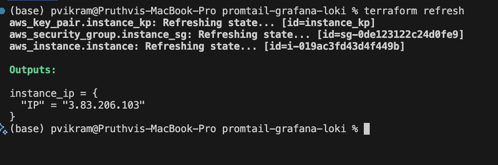
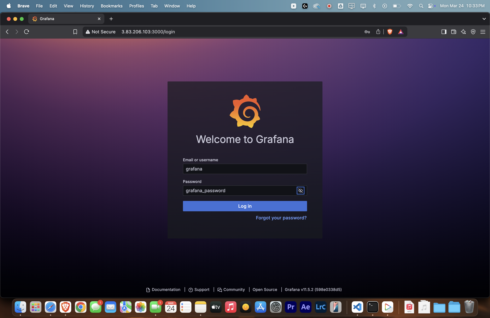
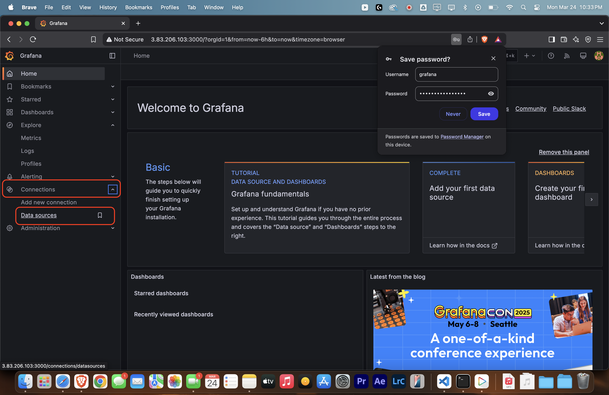
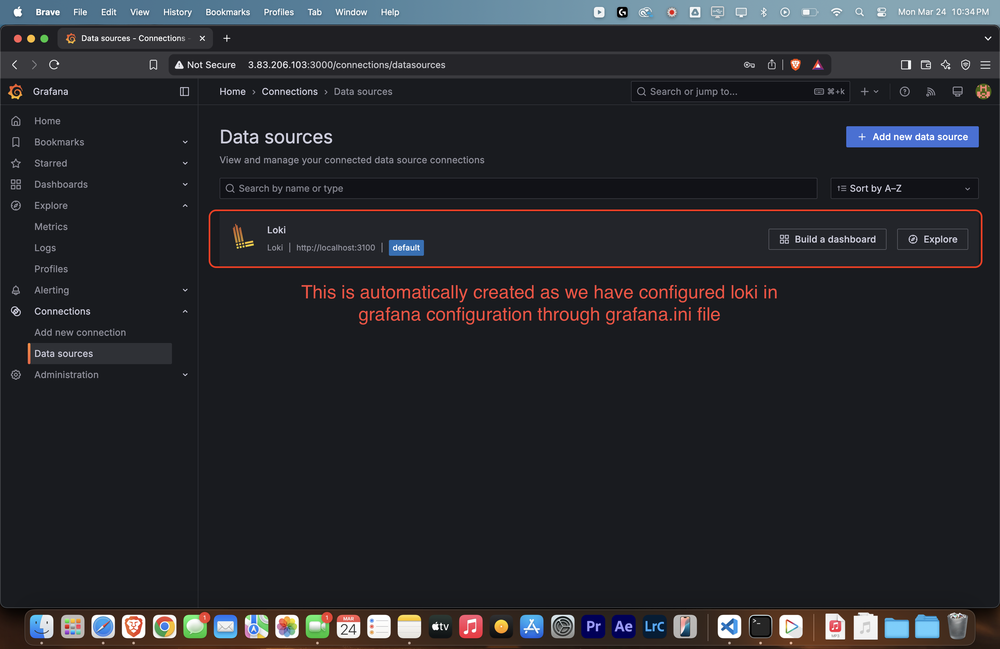
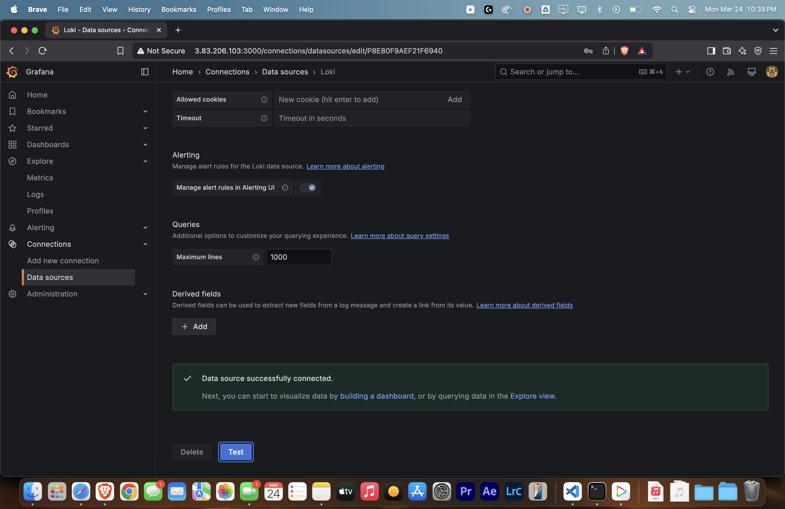
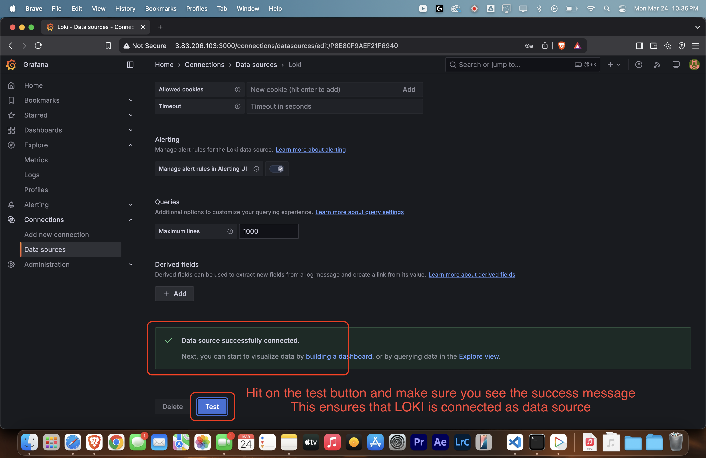
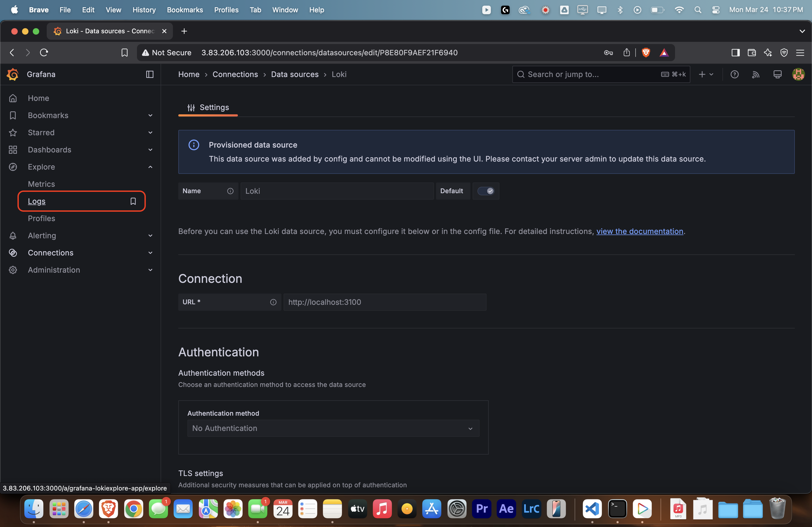
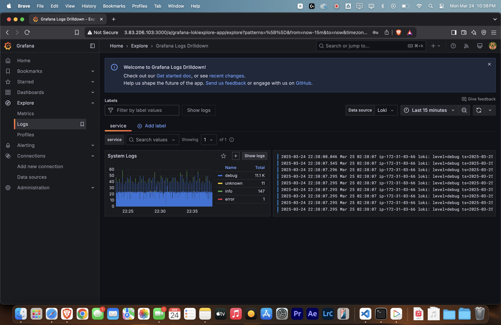
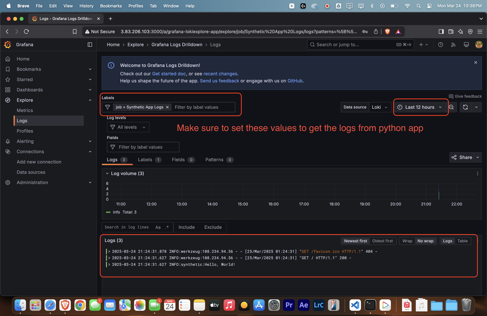

# Setting up monitoring tools

## Overview
In this project, we are setting up a monitoring stack using Grafana, Loki, and Promtail on an AWS EC2 instance. The goal is to collect, aggregate, and visualize logs from the EC2 instance in a centralized manner. 

We use Terraform to provision the infrastructure, ensuring an automated and consistent deployment process. Promtail is configured to collect logs from the EC2 instance and forward them to Loki, which serves as the log aggregation system. Grafana is then used to visualize and analyze the logs, providing insights into system performance and enabling effective troubleshooting.

The project also includes the creation of a synthetic log generator using a Python Flask application, which logs messages to a file at regular intervals. This setup demonstrates the end-to-end flow of log collection, aggregation, and visualization.

## Log Flow
Grafana <- Loki <- Promtail <- EC2 Instance

## Tools Used
- Terraform
- AWS EC2 Instance
- Promtail
- Loki
- Grafana

| Tool | Necessity |
| --- | --- |
|Terraform|Used to provision and manage infrastructure as code, enabling automated deployment of AWS EC2 instances and other resources.|
|EC2|Provides the compute resources necessary to run Promtail, which collects logs from the instance and forwards them to Loki for centralized log management.|
|Promtail|Promtail is an agent that ships the contents of local logs to a Loki instance. It is designed to work seamlessly with Loki, enabling efficient log aggregation and querying. Promtail runs on the EC2 instance, collects logs, and forwards them to Loki for centralized log management.|
|Loki|Loki is a log aggregation system designed to store and query logs efficiently. It works seamlessly with Promtail and Grafana, enabling centralized log management and visualization. Loki indexes metadata rather than the full log content, making it cost-effective and scalable.|
|Grafana|Grafana is an open-source platform for monitoring and observability. It allows users to query, visualize, and analyze metrics and logs from various data sources, including Loki. Grafana provides customizable dashboards, enabling teams to gain insights into system performance and troubleshoot issues effectively. It integrates seamlessly with Loki to display log data in a user-friendly manner.|

# Infrastructure Provisioning
Terraform is used to provision EC2 instances by defining infrastructure as code. It automates the creation, configuration, and management of EC2 resources in AWS. By leveraging Terraform, organizations can achieve greater scalability, maintainability, and efficiency in their infrastructure management processes.

Terraform is a powerful Infrastructure as Code (IaC) tool that simplifies the provisioning and management of cloud resources. 

    By using Terraform, teams can define their infrastructure in a declarative configuration file, ensuring consistency, repeatability, and version control. 
    
    This approach reduces manual intervention, minimizes errors, and accelerates deployment processes.

## File Structure
|File|Importance|
|---|---|
|provider.tf|Defines the cloud provider configuration, enabling Terraform to interact with AWS services.|
|ec2.tf|Contains the configuration for provisioning and managing EC2 instances, including instance type, security groups, and other necessary settings.|
|output.tf|Defines the outputs of the Terraform configuration, allowing users to extract and display key information about the provisioned resources. This file is essential for retrieving details such as instance IDs, public IP addresses, or other resource attributes, which can be used for further automation or integration with other tools.|
|userdata.sh|Contains the user data script that is executed during the initialization of an EC2 instance. This script automates the configuration of the instance by installing necessary software, setting up services, or performing other initialization tasks. For example, it can be used to install Promtail, configure log collection, and ensure that the instance is ready to forward logs to Loki. The `userdata.sh` file is crucial for achieving a consistent and automated setup of EC2 instances.|

## Userdata.sh File

The `userdata.sh` file is a script that automates the setup of the monitoring stack on an EC2 instance. Below is a breakdown of its functionality:

1. **Update System Packages**:
   - Updates the package lists and installs the latest versions of available packages using `yum`.
   ```
   sudo yum update -y
   ```

2. **Install Dependencies**:
   - Installs `wget`, a utility for downloading files from the web.
   ```
   sudo yum install -y wget
   ```

3. **Add Grafana Repository**:
   - Imports the Grafana GPG key and adds the Grafana OSS repository to the system.
   ```
    sudo rpm --import https://packages.grafana.com/gpg.key
    echo "[grafana]
    name=Grafana OSS
    baseurl=https://packages.grafana.com/oss/rpm
    repo_gpgcheck=1
    enabled=1
    gpgcheck=1
    gpgkey=https://packages.grafana.com/gpg.key" | sudo tee /etc/yum.repos.d/grafana.repo
    ```

4. **Install Grafana**:
   - Installs the Grafana monitoring tool from the added repository.
   ```
   sudo yum install -y grafana
   ```

5. **Install Loki and Promtail**:
   - Installs Loki (a log aggregation system) and Promtail (a log collector).
   ```
   sudo yum install loki -y promtail
   ```

6. **Configure Loki**:
   - Creates a configuration file for Loki at `/etc/loki/config.yml` with settings for server, storage, query range, and analytics.
   ```
    sudo tee /etc/loki/config.yml <<EOF
    auth_enabled: false

    server:
    http_listen_port: 3100
    grpc_listen_port: 9096
    log_level: debug
    grpc_server_max_concurrent_streams: 1000

    common:
    instance_addr: 127.0.0.1
    path_prefix: /tmp/loki
    storage:
        filesystem:
        chunks_directory: /tmp/loki/chunks
        rules_directory: /tmp/loki/rules
    replication_factor: 1
    ring:
        kvstore:
        store: inmemory

    query_range:
    results_cache:
        cache:
        embedded_cache:
            enabled: true
            max_size_mb: 100

    limits_config:
    metric_aggregation_enabled: true

    schema_config:
    configs:
        - from: 2020-10-24
        store: tsdb
        object_store: filesystem
        schema: v13
        index:
            prefix: index_
            period: 24h

    pattern_ingester:
    enabled: true
    metric_aggregation:
        loki_address: localhost:3100

    ruler:
    alertmanager_url: http://localhost:9093

    frontend:
    encoding: protobuf

    # By default, Loki will send anonymous, but uniquely-identifiable usage and configuration
    # analytics to Grafana Labs. These statistics are sent to https://stats.grafana.org/
    #
    # Statistics help us better understand how Loki is used, and they show us performance
    # levels for most users. This helps us prioritize features and documentation.
    # For more information on what's sent, look at
    # https://github.com/grafana/loki/blob/main/pkg/analytics/stats.go
    # Refer to the buildReport method to see what goes into a report.
    #
    # If you would like to disable reporting, uncomment the following lines:
    #analytics:
    #  reporting_enabled: false
    EOF
    ```

7. **Configure Promtail**:
   - Creates a configuration file for Promtail at `/etc/promtail/config.yml` to scrape logs from `/var/log/synthetic.log` and send them to Loki.
   ```
    sudo tee /etc/promtail/config.yml <<EOF
    server:
    http_listen_port: 9080
    positions:
        filename: /tmp/positions.yaml
    clients:
        - url: http://localhost:3100/loki/api/v1/push
    scrape_configs:
        - job_name: synthetic_logs
        static_configs:
            - targets:
                - localhost
            labels:
                job: synthetic_logs
                __path__: /var/log/synthetic.log
    EOF
    ```

8. **Configure Grafana**:
   - Creates a configuration file for Grafana at `/etc/grafana/grafana.ini` with settings for server, paths, logging, analytics, and security.
   ```
    sudo tee /etc/grafana/grafana.ini <<EOF
    [server]
    http_port = 3000
    root_url = http://localhost:3000
    [paths]
    data = /var/lib/grafana
    logs = /var/log/grafana
    [log]
    mode = file
    [analytics]
    check_for_updates = true
    [security]
    admin_user = grafana
    admin_password = grafana_password
    [users]
    allow_sign_up = false
    EOF
    ```

9. **Integrate Grafana with Loki**:
   - Appends a Loki datasource configuration to `/etc/grafana/provisioning/datasources/loki.yaml`.
   ```
    sudo tee -a /etc/grafana/provisioning/datasources/loki.yaml <<EOF
    apiVersion: 1
    datasources:
    - name: Loki
        type: loki
        access: proxy
        url: http://localhost:3100
        jsonData:
        maxLines: 1000
        minTimeRange: 1m
    EOF
   ```

10. **Modify Promtail Service**:
    - Updates the Promtail systemd service to run as the `root` user.
    ```
    sudo sed -i 's/User=promtail/User=root/g' /etc/systemd/system/promtail.service
    ```

11. **Enable and Start Services**:
    - Enables and starts the Loki, Promtail, and Grafana services to ensure they run on boot and are active immediately.
    ```
    # Enable and start Loki service
    sudo systemctl enable loki
    sudo systemctl restart loki

    # Enable and start Promtail service
    sudo systemctl enable promtail
    sudo systemctl restart promtail

    # Enable and start Grafana service
    sudo systemctl enable grafana-server
    sudo systemctl restart grafana-server
    ```

12. **Install Python and Flask**:
    - Installs Python 3 and Flask, a lightweight web framework.
    ```
    sudo yum install python3 -y
    sudo pip3 install flask
    ```

13. **Create Synthetic Log File**:
    - Creates an empty log file at `/var/log/synthetic.log` and sets ownership to the `ec2-user`.
    ```
    sudo tee /var/log/synthetic.log <<EOF
    EOF

    sudo chown ec2-user:ec2-user /var/log/synthetic.log
    ```

14. **Build Flask Application**:
    - Writes a Python Flask application (`synthetic.py`) that:
      - Logs "Hello, World!" to `/var/log/synthetic.log` whenever the root endpoint (`/`) is accessed.
      - Logs "Hello, World!" every 60 seconds in the background.
    ```
    tee /home/ec2-user/synthetic.py <<EOF
    from flask import Flask
    import logging
    import time

    app = Flask(__name__)

    @app.route('/')
    def hello_world():
        app.logger.info('Hello, World!')
        return 'Hello, World!'

    if __name__ == '__main__':
        logging.basicConfig(filename='/var/log/synthetic.log', level=logging.INFO)
        app.run(host='0.0.0.0', port=5000)
        while True:
            time.sleep(60)
            app.logger.info('Hello, World!')
    EOF
    ```

15. **Run Flask Application**:
    - Starts the Flask application in the background using `nohup` to ensure it continues running after the script completes.
    ```
    nohup python3 /home/ec2-user/synthetic.py > /var/log/synthetic.log 2>&1 &
    ```

# Setting up and Running the project

## Setup Environment variables
```bash
# Set AWS environment variables for Terraform
export AWS_ACCESS_KEY_ID=<your-access-key-id>
export AWS_SECRET_ACCESS_KEY=<your-secret-access-key>
export AWS_DEFAULT_REGION=<your-default-region>
```
```bash
# Set AWS environment variables for Terraform
set AWS_ACCESS_KEY_ID=<your-access-key-id>
set AWS_SECRET_ACCESS_KEY=<your-secret-access-key>
set AWS_DEFAULT_REGION=<your-default-region>
```

## Follow steps to provision and deploy
```bash
# Clone the repository
git clone <REPO URL>

# Navigate to the project directory
cd promtail-grafana-loki

# Initialize Terraform
terraform init

# Apply the Terraform configuration
terraform apply -auto-approve

# SSH into the provisioned EC2 instance
# You can get the Public IP from terraform output
ssh -i /path/to/your-key.pem ec2-user@<EC2_PUBLIC_IP>

# Verify the setup
# Check if Loki, Promtail, and Grafana services are running
sudo systemctl status loki
sudo systemctl status promtail
sudo systemctl status grafana-server

# Access Grafana in your browser
# Navigate to http://<EC2_PUBLIC_IP>:3000
# Login with the default credentials (admin/grafana_password)
```

```bash
# Clone the repository
git clone <REPO URL>

# Navigate to the project directory
cd promtail-grafana-loki

# Initialize Terraform
terraform init

# Apply the Terraform configuration
terraform apply -auto-approve

# SSH into the provisioned EC2 instance
# You can get the Public IP from terraform output
ssh -i /path/to/your-key.pem ec2-user@<EC2_PUBLIC_IP>

# Verify the setup
# Check if Loki, Promtail, and Grafana services are running
sudo systemctl status loki
sudo systemctl status promtail
sudo systemctl status grafana-server

# Access Grafana in your browser
# Navigate to http://<EC2_PUBLIC_IP>:3000
# Login with the default credentials (admin/grafana_password)
```

# Screenshots


















